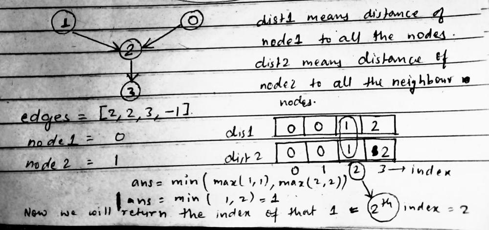

# Day 24 Leetcode Daily Challenge

# [Snakes and Ladders]()

## Graph - BFS
## Intuition
The intuition behind this code is that it uses a breadth-first search (BFS) algorithm to find minimum number of moves required to reach the last call of the board from the first cell. BFS is an algorithm that explores all the vertices of a graph or all the nodes of a tree level by level.
## Approach
The method starts by creating a vector of pair called `cells` that stores the row and column of each cell in the board. It also creates a vector of integers called `dist` that stores the minimum number of moves required to reach each cell and initializes it to -1.

It then uses a queue to keep track of the cells to be visited and starts by pushing the first cell (cell 1) into the queue. The method then enters a while loop that continues until the queue is empty. In each iteration of the loop, it takes the front element o fthe queue, which is the current cell, and pops it from the queue.

For the current cell, the method loops all the possible next cells which are from curr + 1 to min(curr + 6, n * n) (because in each move we can move to a dice roll max 6 steps) assigned yet. If it has not been assigned yet, the method assigns the minimum number of moves required to reach that cell as the minimum number of moves required to reach the current cell plus one. It also pushes the next cell into the queue to be visited in the next iteration.

The method then continues this process untill all the cells have been visited, and the minimum number of moves required to reach each cell has been assigned. Finally, the method returns the minimum number of moves required to reach the last cell, which is stored in dist[n * n].

It also handles the case if there is a snake or ladder at the cell, it directly assigns the destination cell number as the cell number.

## **Complexity**
## . Time complexity:
    The tiem complexity of this code is O(n^2), where n is the size of the board. This because the method uses a breadth-first search algorithm to traverse through each cell of the board and assigns the distance of each cell from the starting cell. The outer loop iterates n times, and the inner loop iterates n tiems, so the total number of iterations is n * n.
    Note that this is assuming the queue and vector operations have a constant time complexity, which is typical but not guaranteed.

## . Space complexity:
    The space complexity of this code is also O(n^2). This is because the method uses a vector of integers called "dist" to keep track of the minimum number of moves required to reach each cell, and this vector has nn elements. The method also uses a vector of pairs called "cells" to keep track of the row and column of each cell, and this vector also has nn elements. The method also uses a queue to keep track of the cells to be visited, which can have at most n*n elements.

## **Code**
```
class Solution {
public:
    int snakesAndLadders(vector<vector<int>> &board) {
        int n = board.size(), lbl = 1;
        vector<pair<int, int>> cells(n*n+1);
        vector<int> columns(n);
        iota(columns.begin(), columns.end(), 0);
        for (int row = n - 1; row >= 0; row--) {
            for (int column : columns) {
                cells[lbl++] = {row, column};
            }
            reverse(columns.begin(), columns.end());
        }
        vector<int> dist(n*n+1, -1);
        dist[1] = 0;
        queue<int> q;
        q.push(1);
        while (!q.empty()) {
            int curr = q.front();
            q.pop();
            for (int next = curr + 1; next <= min(curr+6, n*n); next++) {
                auto [row, column] = cells[next];
                int destination = board[row][column] != -1 ? board[row][column] : next;
                if (dist[destination] == -1) {
                    dist[destination] = dist[curr] + 1;
                    q.push(destination);
                }
            }
        }
        return dist[n*n];
    }
};
```


# Day 25 Leetcode Daily Challenge

# [Find Closest Node to Given Two Nodes](https://leetcode.com/problems/find-closest-node-to-given-two-nodes/description/)

## Graph - DFS
## Intuition


## Approach
1. Initialize variables n to the size of the edges array, ans to -1, and minDist to the maximum value(INT_MIN) of an int.
2. Create two arrays distance1 and distance2 of size n and initialize all elements to 0. Also, create two arrays visited1 and visited2 of size n and initialize all elements to false.
3. Run the depth-first-search(DFS) algorithm from node1 and update the distance1 and visited1 arrays accordingly.
4. Run the DFS algorithm from node2 and update the distance2 and visited2 array accordingly. 
5. Iterate through all nodes curNode in the graph.
6. For each node, check if it has been visited by both DFS calls, and if its maximum distance from node1 and node2 i.e (max(distance1[curNode], distance2[curNode])) is less than the current value of minDist.
7. If the above conditions are met, update the value of minDist and ans to the current node's distance and index, respectively.
8. Return ans as the result.
9. This algorithm finds the closest meeting point between two given nodes in a graph by using DFS to calculate the distance from each node to all other nodes in the graph. It only considers nodes that are reachable from both given nodes, and chooses the one that has the smallest maximum distance from the two given nodes.

## Code 
```class Solution {
    private:
        void dfs(int node, vector<int> &edges, vector<int> &distance, vector<bool> &visited) {
            visited[node] = true;
            int neighbor = edges[node];
            if(neighbor != -1 && visited[neighbor] == false) {
                distance[neighbor] = distance[node] + 1;
                dfs(neighbor, edges, distance, visited);
            } 
        }
    public:
        int closestMeetingNode(vector<int>& edges, int node1, int node2) {
            int n = edges.size();
            int ans = -1;
            int minDist = INT_MAX;
            /**
             * distance1 store the distance from node1 to all the neighbour nodes and 
             * distance2 store the distance form node2 to all the neighbour nodes
             */
            vector<int> distance1(n, 0), distance2(n, 0);
            /**
             * visited array helps us to identify wheather we visited to particular node from node1
             * or not similarly for visited2
             */
            vector<bool> visited1(n, false), visited2(n, false);
            // calling dfs from both the nodes i.e node1 and node2
            dfs(node1, edges, distance1, visited1);
            dfs(node2, edges, distance2, visited2);

            for(int curNode=0; curNode<n; curNode++) {
                if(visited1[curNode] == true && visited2[curNode] == true && minDist > max(distance1[curNode], distance2[curNode])) {
                    minDist = max(distance1[curNode], distance2[curNode]);
                    ans = curNode;
                }
            }
            return ans;
        }
    };

```
